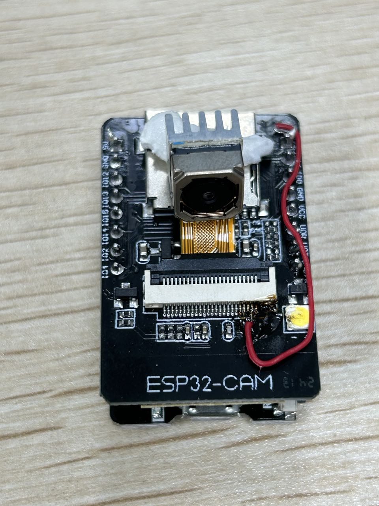

# 2024.06.18

* 跑通ov5640摄像头
* 开发板的摄像头接口的23引脚接3v3实现自动对焦

* 添加舵机功能

| 舵机线颜色 | 功能 | 连接到ESP32引脚 |
| ---------- | ---- | --------------- |
| 红色       | 电源 | 5V              |
| 黑色/棕色  | 地线 | GND             |
| 黄色/橙色  | 信号 | GPIO 13         |

* 舵机5s旋转一下
* 1s打印一次
* 手机开热点连接后：浏览器输入：http://172.20.10.14/stream
